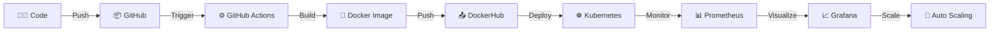

<div align="center">

# 🚀 Aaman Shaikh

### 💻 DevOps Engineer | Cloud | Automation


</div>

---

## 🧑‍💻 About Me

```yaml
Name: Aaman Shaikh
Role: DevOps Engineer (In Progress 🚀)
Location: Pune, India 🇮🇳
Education: MCA (2026)

Interests:
  - Cloud Computing ☁️
  - DevOps Automation ⚙️
  - Kubernetes & Containers 🐳
  - CI/CD Pipelines 🚀

Current Focus:
  - Building real-world DevOps projects
  - Learning Kubernetes, Terraform, AWS
  - Automating deployments

Mindset: "Automate Everything. Scale Anything."
```

---

## ⚙️ Animated DevOps Lifecycle



---

## 🛠️ Tech Stack

<div align="center">

### ⚙️ DevOps Tools


### 💻 Programming


</div>

---

## 📊 GitHub Analytics

<div align="center">


</div>

---

## 🔥 Activity & Streak

<div align="center">


</div>

---

## 🐍 Contribution Snake

<div align="center">


</div>

---

## 🐳 DevOps Badges

<div align="center">


</div>

---

## 🌐 Connect With Me

<div align="center">

<a href="https://www.linkedin.com/in/aaman-shaikh-3a95ba235">

</a>

<a href="mailto:shaikhaaman600@gmail.com">

</a>

</div>

---

## 👀 Profile Views

<div align="center">


</div>

---

<div align="center">


### ⚡ SYSTEM STATUS: RUNNING 🚀

</div>
