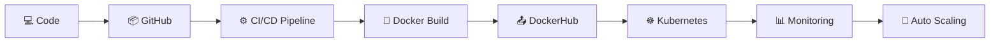

<div align="center">


</div>

---

## 🧠 DevOps Identity

```yaml
Name: Aaman Shaikh
Role: DevOps Engineer (Learning & Building 🚀)
Location: Pune, India 🇮🇳

Core Focus:
  - CI/CD Pipelines ⚙️
  - Cloud Infrastructure ☁️
  - Containerization 🐳
  - Kubernetes Orchestration ☸️

Philosophy:
  "Automate Everything. Scale Anything."
```

---

## ⚙️ DevOps Pipeline Architecture



---

## 🛠️ Tech Arsenal

<div align="center">


<br/><br/>


</div>

---

## 📡 DevOps Metrics Dashboard

<div align="center">


</div>

---

## 📈 Contribution Intelligence

<div align="center">


</div>

---

## 🐍 DevOps Activity Engine

<div align="center">


</div>

---

## ⚡ System Status

<div align="center">


</div>

---

## 🌐 Network Links

<div align="center">

<a href="https://www.linkedin.com/in/aaman-shaikh-3a95ba235">

</a>

<a href="mailto:shaikhaaman600@gmail.com">

</a>

</div>

---

## 👀 Profile Monitoring

<div align="center">


</div>

---

<div align="center">


### ⚡ SYSTEM ONLINE — READY FOR DEPLOYMENT 🚀

</div>
