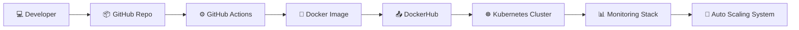

<div align="center">


</div>

---

## 🧠 DevOps Profile

```yaml
Name: Aaman Shaikh
Role: DevOps Engineer (Learning Phase 🚀)
Location: Pune, India 🇮🇳

Specialization:
  - CI/CD Pipelines ⚙️
  - Cloud Infrastructure ☁️
  - Containerization 🐳
  - Kubernetes ☸️

Vision:
  Build scalable, automated, production-ready systems
```

---

## ⚙️ System Architecture



---

## 🛠️ Tech Ecosystem

<div align="center">


<br/><br/>


</div>

---

## 🚀 DevOps Projects Showcase

<div align="center">

<table>
<tr>
<td width="50%">

### 🔧 CI/CD Pipeline

Automated build & deployment using GitHub Actions + Docker

</td>

<td width="50%">

### ☸️ Kubernetes Setup

Local cluster using Kind + kubectl

</td>
</tr>

<tr>
<td width="50%">

### 🐳 Docker Deployment

Containerized portfolio & apps

</td>

<td width="50%">

### ☁️ Cloud Setup (Learning)

AWS + Terraform (in progress)

</td>
</tr>
</table>

</div>

---

## 📊 System Analytics

<div align="center">


</div>

---

## 📈 Contribution Insights

<div align="center">


</div>

---

## 🐍 Automation Activity (Snake Engine)

<div align="center">

<picture>
  <source media="(prefers-color-scheme: dark)" srcset="https://raw.githubusercontent.com/Shaikhaamann/Shaikhaamann/output/github-snake-dark.svg" />
  <source media="(prefers-color-scheme: light)" srcset="https://raw.githubusercontent.com/Shaikhaamann/Shaikhaamann/output/github-snake.svg" />
  
</picture>
</div>


---

## 📦 Productivity Overview

<div align="center">


</div>

---

## 🌐 Connect Layer

<div align="center">

<a href="https://www.linkedin.com/in/aaman-shaikh-3a95ba235">

</a>

<a href="mailto:shaikhaaman600@gmail.com">

</a>

</div>

---

## 👀 Profile Monitoring

<div align="center">


</div>

---

## 😂 Dev Humor (because DevOps needs patience)

<div align="center">


</div>

---

<div align="center">


### ⚡ SYSTEM ACTIVE — DEPLOYMENT READY 🚀

</div>
